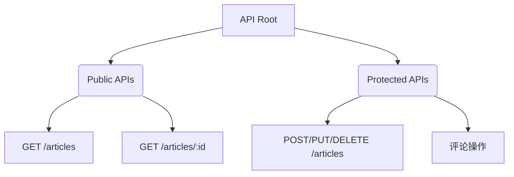

# greenbook

bupt web课设

```mermaid
graph TD
  A[API Root] --> B(Public APIs)
  A --> C(Protected APIs)
  B --> D[GET /articles]
  B --> E[GET /articles/:id]
  C --> F[POST/PUT/DELETE /articles]
  C --> G[评论操作]
```
